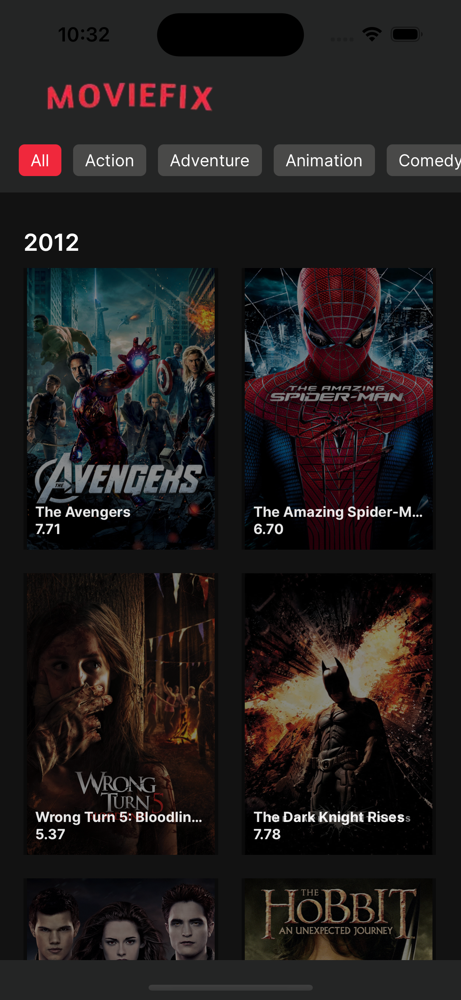

# MovieFix App

## Setup
1. he project is built using YARN package manager
2. Node js Version - 18 and above
3. Built using expo with latest react native version (0.74)
4. Clone the repo `git clone https://github.com/nishanthbhat07/moviefix-app.git`
5. After cloning, `cd movies_app` and install node_modules by doing `yarn`

###  IOS
1. Once node_modules are installed, we need to install all the pods related to the project. For doing this you can do either of the following:
	a. npx pod-install
	b. `cd ios && pod install && cd..`
2. After installing pods, run the following command to make an IOS build on simulator: `yarn ios`. And also open a new terminal to start the metro server `yarn start`

## Android
1. For build android build, use the following command: `yarn android`. And also open a new terminal to start the metro server `yarn start`

## Libraries Used
- Expo Image -  for rendering images
- Expo Router - for Screen routing
- React Query -  For API calls and pagination
- Typescript
- Fonts used - Inter

## Features included
1. Pagination of data for fetching movies
2. Fetch movies by genre
3. Multiple select genres
4. Smoothly scroll upwards and downwards

## Features not includes
1. Search movie functionality

## Assumptions
1. Displaying only top 20 movies per year
2. Pagination is done on year (primary_release_year) and not on page parameter which is provided in API request params.

## Demo

Please download the demo.mov to see the demo video

[APK](moviefix.apk)

APK (Drive Link)[https://drive.google.com/file/d/1TfoNwXO6s_JsNtyuBWtkPjPIbR9RiC4C/view?usp=sharing]

## Snapshots

